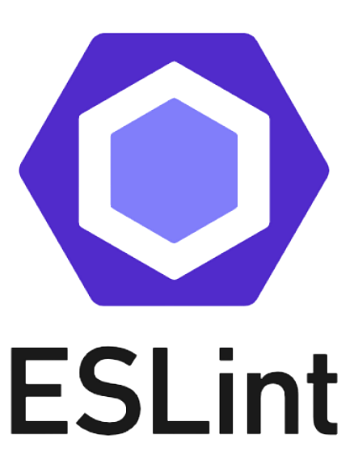

<h1 align="center">  Hi, I'm Mykhailo 👋 </h1>

  

📍 I am from Ukraine, currently located in Berlin.

  
  
  
  
   
   

 

<h3>My stack:</h3>

&nbsp; 
&nbsp; 
&nbsp; 
&nbsp; 
&nbsp; 
&nbsp;
&nbsp; 
&nbsp; 
&nbsp; 
&nbsp; 
&nbsp; 
&nbsp; 
&nbsp; 
&nbsp; 

 

Open to internship opportunities to further enhance my skills and contribute effectively.
Eager to learn and apply new technologies in a hands-on environment.

🙏 Thank you for considering my profile!

 
